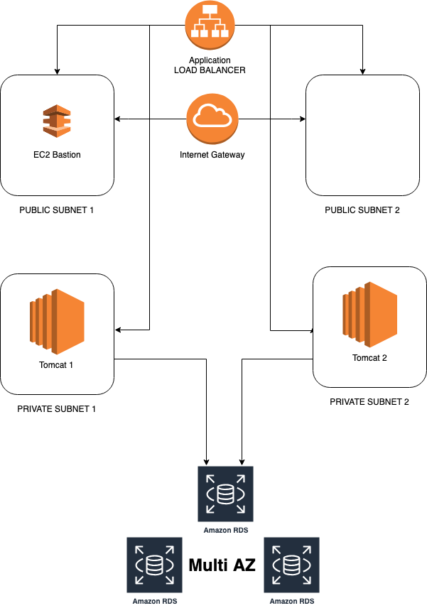

# Automatic Deploy Load Balancer + Two instances EC2 + RDS + Terraform + User Data on AWS

**Project goal:**

- Automatic deployment of the application stack:
    - 2 EC2 instances (Tomcat)
    - one RDS Postgres (MZ)
    - Frontend - Load Balancer
    
    
 For automatic deployment is desiganted Terraform tool.
 
 # Diagram
 
 
 
 
 
 
  + create
  + aws_db_instance.postgres
  + aws_db_subnet_group.subnetdb
  + aws_instance.oneweb-bastion
  + aws_instance.oneweb-server1
  + aws_instance.oneweb-server2
  + aws_internet_gateway.igw
  + aws_lb.LB-OneWeb
  + aws_lb_listener.lb-listener
  + aws_lb_target_group.lb-tg
  + aws_lb_target_group_attachment.lb-attachment-Server1
  + aws_lb_target_group_attachment.lb-attachment-Server2
  + aws_route.r
  + aws_route_table.public
  + aws_route_table_association.assoc1
  + aws_route_table_association.assoc2
  + aws_security_group.Bastion
  + aws_security_group.SG-DB
  + aws_security_group.SG-OneWeb
  + aws_subnet.Private-Primary
  + aws_subnet.Private-Secondary
  + aws_subnet.Public-Primary
  + aws_subnet.Public-Secondary
  + aws_subnet.db1
  + aws_subnet.db2
  + aws_vpc.VPC-OneWeb
    
  
